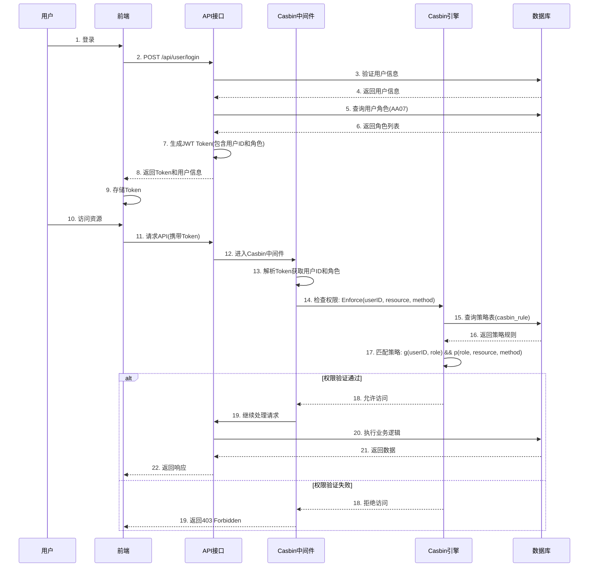
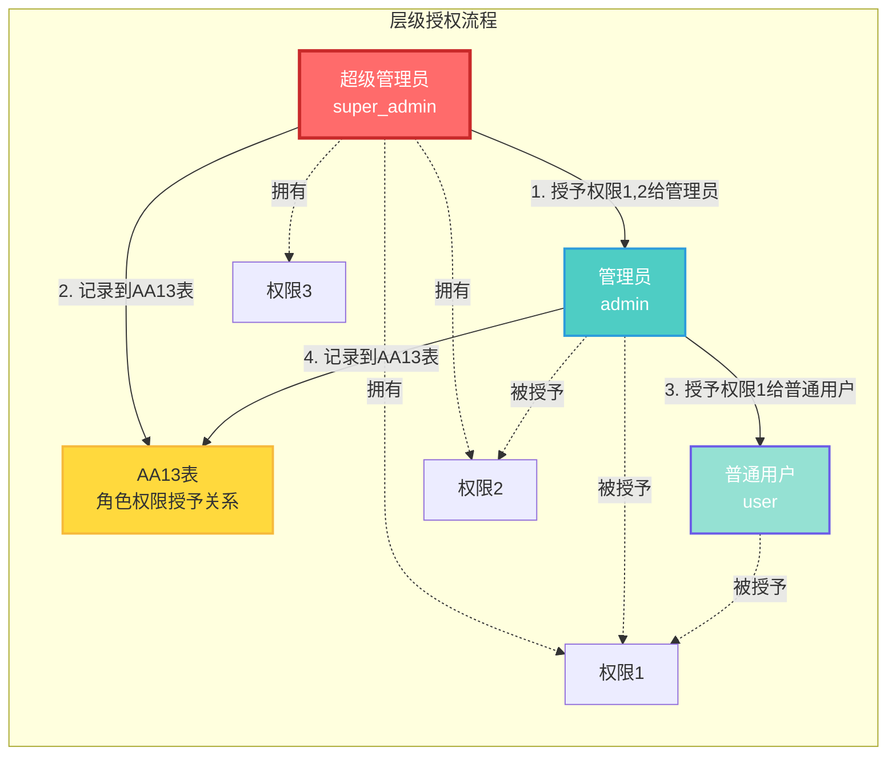
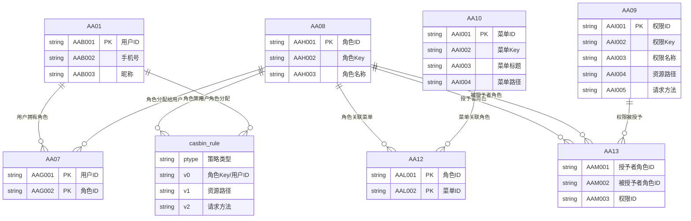
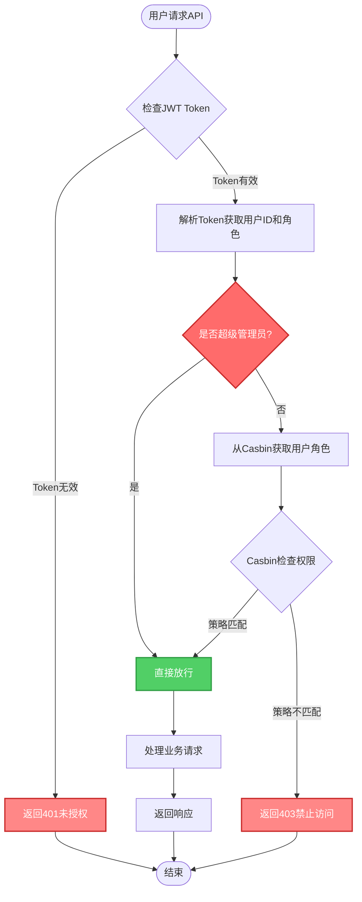
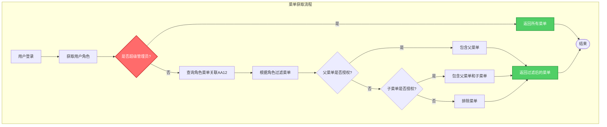

# LN Admin 权限控制架构图

## 系统权限控制架构

```mermaid
graph TB
    subgraph "用户层"
        U1[用户1<br/>User ID: user_001]
        U2[用户2<br/>User ID: user_002]
        U3[用户3<br/>User ID: user_003]
    end

    subgraph "角色层"
        SA[超级管理员<br/>super_admin]
        AD[管理员<br/>admin]
        UR[普通用户<br/>user]
    end

    subgraph "权限层"
        P1[权限1<br/>user:list]
        P2[权限2<br/>user:create]
        P3[权限3<br/>sms:send]
        P4[权限4<br/>file:upload]
        P_ALL[所有权限<br/>All Permissions]
    end

    subgraph "资源层"
        R1[API资源<br/>/api/user/list]
        R2[API资源<br/>/api/user/create]
        R3[API资源<br/>/api/sms/send]
        R4[API资源<br/>/api/file/upload]
    end

    subgraph "菜单层"
        M1[菜单1<br/>用户管理]
        M2[菜单2<br/>短信管理]
        M3[菜单3<br/>文件管理]
    end

    subgraph "数据库表"
        T1[AA07<br/>用户角色关联表]
        T2[AA08<br/>角色表]
        T3[AA09<br/>权限表]
        T4[AA10<br/>菜单表]
        T5[AA12<br/>角色菜单关联表]
        T6[AA13<br/>角色权限授予关系表]
        T7[casbin_rule<br/>Casbin策略表]
    end

    %% 用户-角色关联
    U1 -->|拥有| SA
    U2 -->|拥有| AD
    U3 -->|拥有| UR
    U1 -.->|存储| T1
    U2 -.->|存储| T1
    U3 -.->|存储| T1

    %% 角色-权限授权关系（层级授权）
    SA -->|授予所有权限| P_ALL
    SA -->|授予权限1,2| AD
    AD -->|授予权限1| UR
    SA -.->|记录授予关系| T6
    AD -.->|记录授予关系| T6

    %% 权限-资源映射
    P1 -->|控制| R1
    P2 -->|控制| R2
    P3 -->|控制| R3
    P4 -->|控制| R4
    P1 -.->|存储| T3
    P2 -.->|存储| T3
    P3 -.->|存储| T3
    P4 -.->|存储| T3

    %% Casbin策略
    SA -->|策略: p, super_admin, *, *| T7
    AD -->|策略: p, admin, /api/user/list, GET| T7
    UR -->|策略: p, user, /api/user/list, GET| T7

    %% 角色-菜单关联
    SA -->|关联所有菜单| M1
    SA -->|关联所有菜单| M2
    SA -->|关联所有菜单| M3
    AD -->|关联菜单1| M1
    AD -->|关联菜单2| M2
    AD -.->|存储| T5
    SA -.->|存储| T5

    %% 角色存储
    SA -.->|存储| T2
    AD -.->|存储| T2
    UR -.->|存储| T2

    %% 菜单存储
    M1 -.->|存储| T4
    M2 -.->|存储| T4
    M3 -.->|存储| T4

    style SA fill:#ff6b6b,stroke:#c92a2a,stroke-width:3px,color:#fff
    style AD fill:#4ecdc4,stroke:#2d9cdb,stroke-width:2px,color:#fff
    style UR fill:#95e1d3,stroke:#6c5ce7,stroke-width:2px,color:#fff
    style P_ALL fill:#feca57,stroke:#ff9ff3,stroke-width:2px
    style T6 fill:#ffd93d,stroke:#f6b93b,stroke-width:2px
    style T7 fill:#a29bfe,stroke:#6c5ce7,stroke-width:2px
```

## 权限控制流程

## 层级授权机制

## 数据库表关系

## 权限检查逻辑

## 菜单权限控制

## 核心组件说明

### 1. 角色体系
- **超级管理员（super_admin）**：拥有所有权限，可以给任何角色授权
- **管理员（admin）**：只能看到被授予的权限，可以给普通用户授权
- **普通用户（user）**：只能看到被授予的权限，不能授权

### 2. 数据库表
- **AA07**：用户角色关联表，存储用户和角色的多对多关系
- **AA08**：角色表，存储角色基本信息
- **AA09**：权限表，存储权限定义
- **AA10**：菜单表，存储菜单定义
- **AA12**：角色菜单关联表，存储角色和菜单的多对多关系
- **AA13**：角色权限授予关系表，存储层级授权关系（授予者、被授予者、权限）
- **casbin_rule**：Casbin策略表，存储权限规则（p策略和g策略）

### 3. 权限控制流程
1. 用户登录 → 生成JWT Token（包含用户ID和角色）
2. 请求API → Casbin中间件验证权限
3. 权限检查 → Casbin引擎匹配策略
4. 授权决策 → 允许或拒绝访问

### 4. 层级授权机制
- 超级管理员可以授予任何权限给任何角色
- 管理员只能授予自己被授予的权限给普通用户
- 所有授权关系都记录在AA13表中，确保可追溯

### 5. 菜单权限控制
- 超级管理员可以看到所有菜单
- 其他角色只能看到被授权的菜单
- 如果子菜单被授权，父菜单会自动显示（作为容器）

## 技术栈

- **权限引擎**：Casbin (RBAC模型)
- **策略存储**：MySQL (GORM适配器)
- **认证方式**：JWT Token
- **中间件**：Gin Casbin中间件
- **数据库**：MySQL

